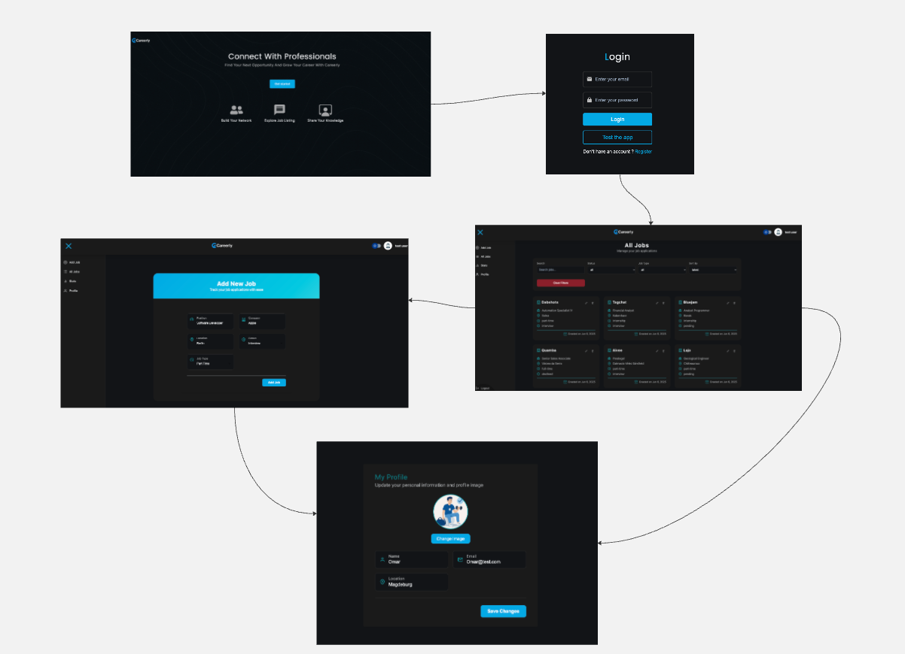

# Careerly

Full-stack job application manager with progress tracking, dashboard, and image uploads.

### Frontend

- **Framework:** React (via Vite)
- **Styling:** Tailwind CSS, DaisyUI, styled-components, react-icons
- **State/Data:** @tanstack/react-query, Axios
- **Visualization:** Chart.js, react-chartjs-2
- **Routing:** react-router

#### Folder Structure

```
frontend/
├── public/
├── src/
│   ├── assets/
│   ├── components/
│   ├── pages/
│   ├── hooks/
│   ├── utils/
│   ├── App.jsx
│   └── main.jsx
├── package.json
└── README.md
```

#### Key Features

- User authentication & registration
- Job board: browse, search, and apply for jobs
- Pagination for improved navigation through job listings
- Dashboard with analytics (charts, stats)
- Profile Management
- Responsive, dark-theme support
- Toast notifications and UX enhancements

## Backend

- **Language/Runtime:** Node.js
- **Framework:** Express.js
- **Database:** MongoDB (via Mongoose)
- **Authentication:** JWT (jsonwebtoken)
- **Security:** Helmet, express-rate-limit, express-mongo-sanitize, cookie-parser
- **Utilities:** dotenv, dayjs, multer, nanoid, morgan, chalk, cloudinary

#### Folder Structure

```
backend/
├── controllers/
├── models/
├── routes/
├── middleware/
├── utils/
├── index.js
├── package.json
└── .env (see below)
```

#### Key Features

- RESTful API for job, user, and application management
- JWT-based authentication and role management
- Follows Model-View-Controller (MVC) architecture for clean separation of concerns
- Advanced query support: sorting, pagination, and searching
- File uploads (e.g., resumes, avatars) with Multer and Cloudinary
- Input validation and rate limiting
- Logging and error handling
- Environment-based configuration
- Test user access available for demo and evaluation purposes

## Environment Variables

| Name                    | Description                                   | Example Value                        |
| ----------------------- | --------------------------------------------- | ------------------------------------ |
| `PORT`                  | Port on which the backend server runs         | `3000`                               |
| `MONGODB_URI`           | MongoDB connection string                     | `mongodb://localhost:27017/careerly` |
| `JWT_SECRET`            | Secret key for JWT signing                    | `<your_jwt_secret>`                  |
| `CLOUDINARY_CLOUD_NAME` | Cloudinary account cloud name                 | `<your_cloud_name>`                  |
| `CLOUDINARY_API_KEY`    | Cloudinary API key                            | `<your_api_key>`                     |
| `CLOUDINARY_API_SECRET` | Cloudinary API secret                         | `<your_api_secret>`                  |
| `NODE_ENV`              | Node environment (`development`/`production`) | `development`                        |
| `FRONTEND_URL`          | URL of the frontend app for CORS              | `http://localhost:5173`              |

Be sure to create a `.env` file in the `backend/` directory with these variables.

## Setup Guide

### 1. Clone the Repository

```sh
git clone https://github.com/EnigmaXV/Careerly.git
cd Careerly
```

### 2. Install Dependencies

**Install backend dependencies:**

```sh
npm install
```

**Install frontend dependencies:**

```sh
cd frontend
npm install
```

#### Start the backend :

```sh
npm run dev
```

This will run `nodemon backend/index.js` (as defined in root `package.json`), starting the Express server.

#### Start the frontend:

In a new terminal, from the `frontend/` directory:

```sh
npm run dev
```

This will start the Vite development server (usually at http://localhost:5173).

## Screenshot


